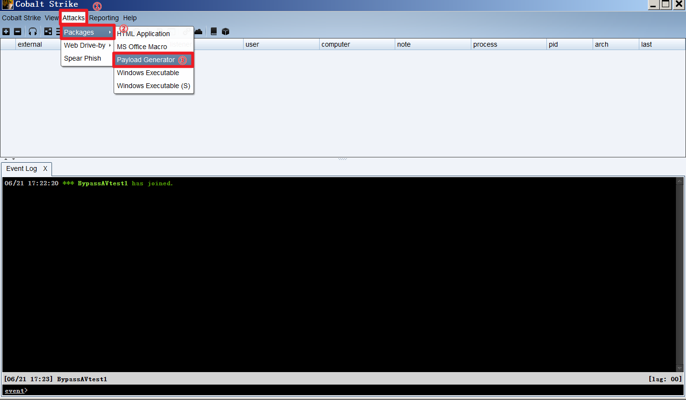
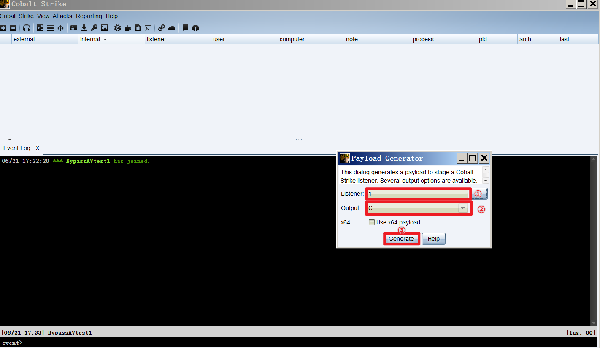
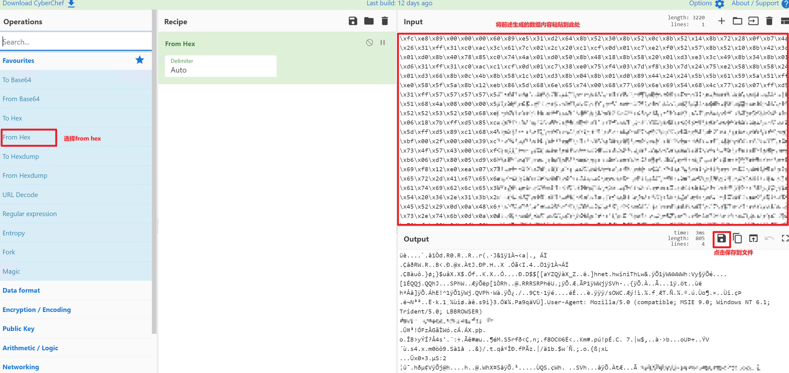
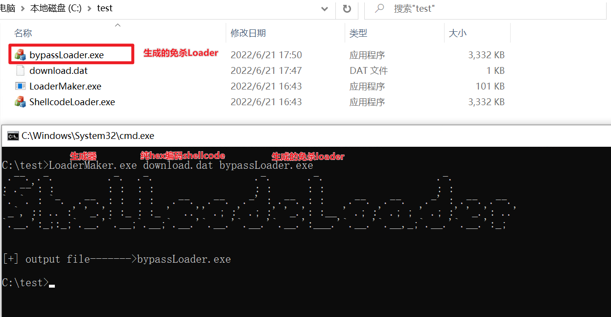
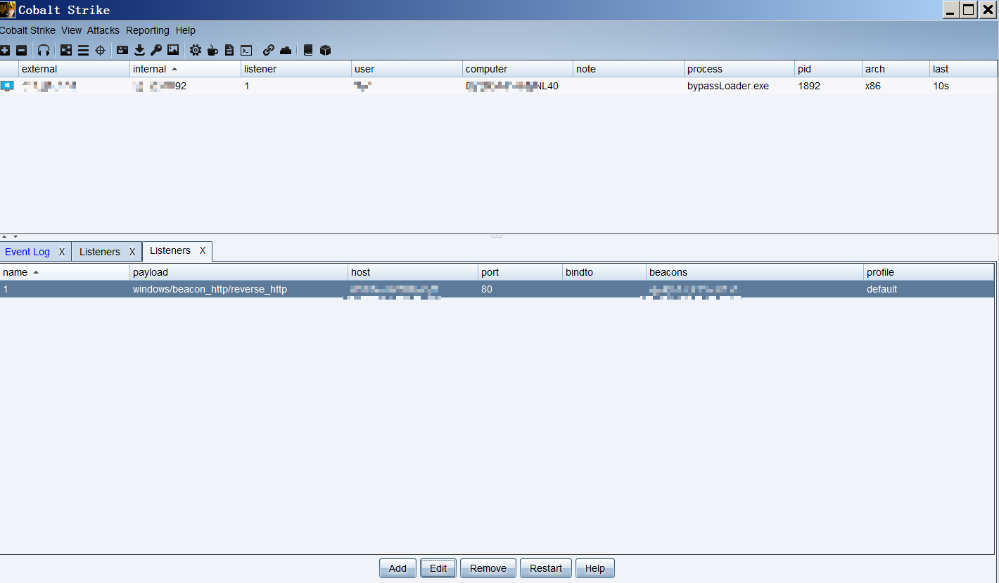
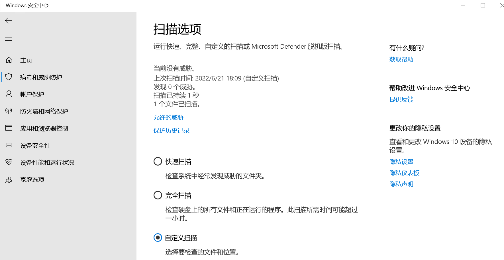
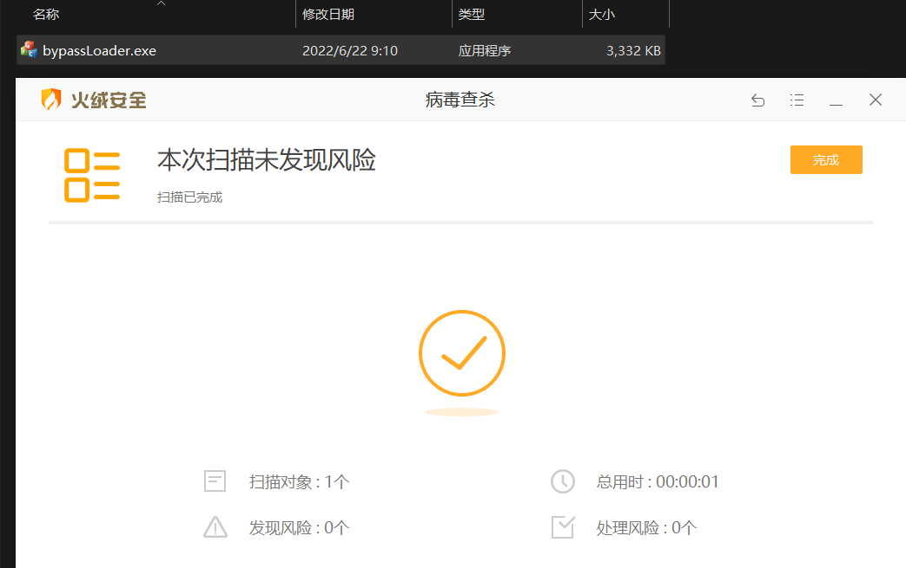
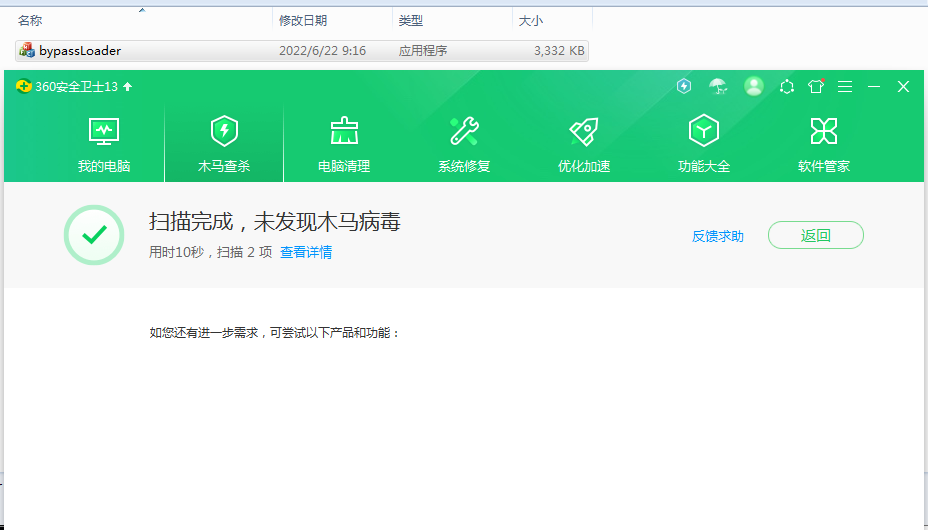
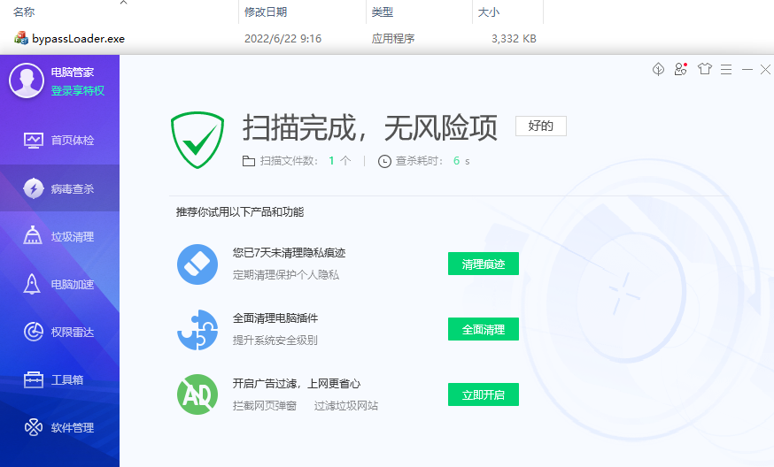

# ShellcodeLoader

Windows通用免杀shellcode加载器。
## V1.1
在maker中添加了用于程序自身提权的代码，防止可能会因为程序权限不足而导致内存读写失败问题；

PS：下个版本将会更新杀软模拟沙箱检测功能，库代码干扰混淆功能；

## 功能特点

1. 使用MFC框架编写shellcodeLoader模板；
2. 使用简洁的C++开发LoaderMaker生成器；
3. 截至发布日期，该shellcodeLoader可免杀国内外主流杀毒软件；
```
   .--. .-.         .-.  .-.                 .-.      .-.                   .-.           
: .--': :         : :  : :                 : :      : :                   : :           
`. `. : `-.  .--. : :  : :   .--.  .--.  .-' : .--. : :    .--.  .--.   .-' : .--. .--. 
 _`, :: .. :' '_.': :_ : :_ '  ..'' .; :' .; :' '_.': :__ ' .; :' .; ; ' .; :' '_.': ..'
`.__.':_;:_;`.__.'`.__;`.__;`.__.'`.__.'`.__.'`.__.':___.'`.__.'`.__,_;`.__.'`.__.':_;  
                                                                                        
```
## 项目构成
   LoaderMaker.exe(shellcodeloader生成器)
   
   ShellcodeLoader.exe(shellcodeloader模板文件)
## 编译环境

   环境:生成器使用C++实现，加载器使用MFC开发，VS2022静态编译。

   方法:下载源码，使用visual studio进行编译。也可以从[realse](https://github.com/ByPassAVTeam/ShellcodeLoader/releases/)下载release版本直接使用。


## 使用方法

1. **打开生成器查看帮助**

  ```
  C:\>LoaderMaker.exe
 .--. .-.         .-.  .-.                 .-.      .-.                   .-.
: .--': :         : :  : :                 : :      : :                   : :
`. `. : `-.  .--. : :  : :   .--.  .--.  .-' : .--. : :    .--.  .--.   .-' : .--. .--.
 _`, :: .. :' '_.': :_ : :_ '  ..'' .; :' .; :' '_.': :__ ' .; :' .; ; ' .; :' '_.': ..'
`.__.':_;:_;`.__.'`.__;`.__;`.__.'`.__.'`.__.'`.__.':___.'`.__.'`.__,_;`.__.'`.__.':_;

[*]usage:
[*]LoaderMaker.exe <shellcode.c>  <outfile.exe>
[*]example:
[*]LoaderMaker.exe shellcode.bin loader.exe

C:\>
```

2. **使用CobaltStrike生成payload.c文件**

   1、点击生成payload(也可以在output栏选择生成RAW格式，RAW格式可直接载入LoadMaker)
   
   

3. **将payload.c转换为纯hex编码**

   1、打开第二步所生成的payload.c
   
   2、复制**引号内**数据(注意！不要复制整个文件，只需要""双引号内的内容)
   
   3、使用在线工具[CyberChef](https://gchq.github.io/CyberChef/#recipe=From_Hex('Auto'))将数据转换为纯hex(地址：https://gchq.github.io/CyberChef/#recipe=From_Hex('Auto'))
   
   
   4、将转换后的数据保存到文件
   

4. **生成免杀Loader**

   参数如下：
   
      LoaderMaker.exe是生成器
      
      download.dat是CyberChef生成的hex文件
      
      bypassloader.exe是最终我们生成的免杀shellcode加载器
   ```
   LoaderMaker.exe download.dat bypassLoader.exe
   
   ```
   直接执行bypassLoader.exe,上线成功
   
   
## 部分免杀效果展示


 **Windows Defender**


 **火绒**


 **360**


 **腾讯电脑管家**

